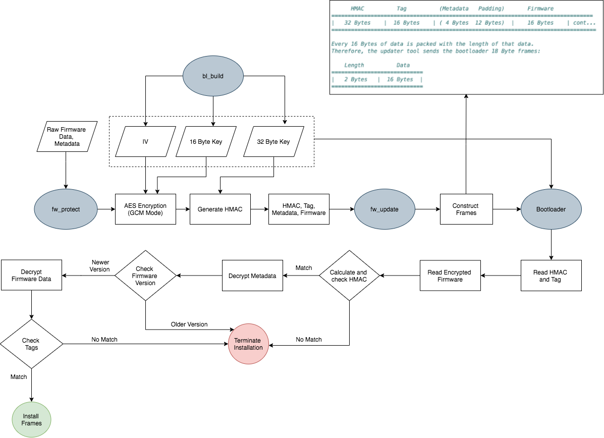

# BWSI Embedded Security & Hardware Hacking Design Challenge
We designed a secure firmware distribution system using encryption protocols such as AES in GCM mode and HMAC.

## Requirements
* Python 3
* C
* BearSSL

## Installation
1. Install the requirements above
2. Clone the repository

## Running the Program
1. Navigate to the `design-challenge-non-zero-exit` folder
2. Run the following
`python3 tools/bl_build.py`

`python3 tools/fw_protect.py --infile firmware/firmware/gcc/main.bin --outfile firmwareblob.blob --version VRESION --message MESSAGE`

`python3 tools/bl_emulate.py`

`python3 tools/fw_update.py --port /embsec/UART1 --firmware firmwareblob.blob`

###  bl_build.py

This tool generates a 16 byte key and 16 byte IV, both of which are used in the AES encryption. A 32 byte key is also generated for the HMAC. These keys are passed to the bootloader and the secret_build_output.txt file, which is accessible by the host tools. The bootloader is also built in this tool.

### fw_protect.py

This tool sends the metadata, firmware, and message to the fw_update.py tool, encrypted under AES in GCM mode. It also attaches an HMAC for an additional layer of authentication.

### fw_update.py

The firmware loads the tag, the metadata, and then the firmware into the bootloader. The firmware is loaded into the firmware in 18 byte frames, with the first two bytes being a short indicating the length of the data and the last 16 bytes being the firmware data.

### bootloader.c

The bootloader reads in the HMAC and tag from the frames it receives. It also reads in the encrypted frames of firmware data and verifies the authenticity using the HMAC. If the check fails, then the bootloader will terminate the installation of the firmware. If the check passes, then the bootloader will proceed to decrypt the metadata. It then checks that the firmware version is correct; if it isn't, then the installation will be terminated. Otherwise, the firmware data will be decrypted using the keys that were passed to the bootloader when bl_build.py was run. The tags of the data will be checked. If the check fails, the installation will be terminated. Otherwise, the bootloader will install the frames.

### Flow Diagram

